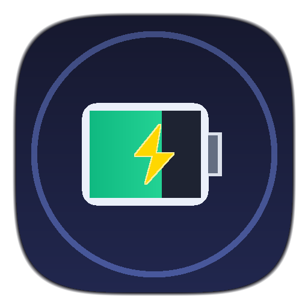

# 🔋 Battery Alarm Monitor

<p align="center">
  
</p>

<p align="center">
  <b>A lightweight, fast, and unmissable battery alarm desktop app for macOS & Windows.</b><br>
  Never let your laptop die unexpectedly again.
</p>

---

## ⚡ Highlights

* **Real-Time Battery Tracking**: Monitors battery percentage, discharging state, and power source with zero-latency native OS integration (`pmset -g batt` on macOS, CIM/WMI on Windows).
* **Multiple Customizable Thresholds**: Define as many percentage triggers as you need (e.g. 20% Warning, 10% Critical, 5% Emergency). Toggle, edit, or delete them anytime.
* **Loud Looping Alarm Engine**:
  * Bundled synthesized loud alarm presets:
    * 🚨 **Urgent Siren**: Fast oscillating loud alarm
    * ⏰ **Digital Alarm**: High-frequency rapid beeps
    * 🔔 **Alert Bell**: Sharp repeating acoustic warning
  * **Custom Audio File Picker**: Load your own `.mp3`, `.wav`, `.m4a`, or `.ogg` audio files.
  * Dedicated in-app **Volume Slider** (0% to 100%) and **Test Alarm** button.
* **Smart Auto-Disarm on Plug-in**: The moment you plug your charger into AC power, the alarm automatically silences itself.
* **Snooze & Dismiss Controls**:
  * **Snooze**: Temporarily silence the alarm for 2, 5, 10, or 15 minutes.
  * **Dismiss**: Silences current percentage level with anti-flapping protection (will only ring again if battery drops into a lower threshold or recharges and drains again).
* **Menu Bar & System Tray Integration**:
  * Minimizes cleanly to the macOS menu bar or Windows system tray.
  * Shows live battery status tooltip in the tray.
  * Closing the window keeps monitoring active in the background.
  * Automatically un-minimizes, shows, and focuses the app window with an urgent alert banner when an alarm triggers.
* **Adaptive Power-Saving**: Checks every 5 seconds while on battery, and automatically throttles to 20 seconds when connected to AC power (<0.1% CPU usage).

---

## 📸 Screenshots & Architecture

```
lib/
├── main.dart                          # App entry point, desktop window & tray wiring
├── models/
│   ├── battery_info.dart              # Battery level, charging status, power source
│   ├── threshold_rule.dart            # Threshold rules with JSON serialization
│   └── alarm_state.dart               # Idle, ringing, and snoozed states
├── services/
│   ├── battery_service.dart           # Battery monitor with native OS fallbacks
│   ├── alarm_service.dart             # Low-latency looping audio player & volume
│   ├── tray_window_service.dart       # System tray & window focus management
│   └── settings_service.dart          # Local settings persistence (SharedPreferences)
├── controllers/
│   └── battery_alarm_controller.dart  # Central reactive state controller
└── ui/
    ├── dashboard_screen.dart          # Desktop dashboard screen
    └── widgets/
        ├── battery_gauge.dart         # Real-time battery indicator
        ├── active_alarm_banner.dart   # Urgent pulsing banner with Snooze/Dismiss
        ├── threshold_list.dart        # Add/edit/delete/toggle threshold cards
        └── audio_settings_card.dart   # Preset selector, file picker, volume slider
```

---

## 🚀 Getting Started

### Prerequisites

* [Flutter SDK](https://docs.flutter.dev/get-started/install) (3.47.2+ recommended)
* **macOS**: Xcode 15+ (for macOS desktop builds)
* **Windows**: Visual Studio 2022 with Desktop development with C++ workload

### 1. Clone & Install Dependencies

```bash
cd batterie
flutter pub get
```

### 2. Run the App

#### On macOS:
```bash
flutter run -d macos
```

#### On Windows:
```bash
flutter run -d windows
```

---

## 🛠️ Building Release Binaries

### macOS App Bundle

To compile an optimized native macOS application:
```bash
xcodebuild -workspace macos/Runner.xcworkspace -scheme Runner -configuration Release -destination 'platform=macOS' build
```
The compiled bundle will be available under:
```
build/macos/Build/Products/Release/batterie.app
```

### Windows Executable

```bash
flutter build windows --release
```
The compiled executable and dependencies will be located in:
```
build/windows/x64/runner/Release/
```

---

## 🧪 Testing

The project has full automated test coverage for domain models, parsers, audio path resolution, settings persistence, hysteresis controller logic, and UI widgets:

```bash
# Run static analysis
flutter analyze

# Run all automated tests
flutter test
```

---

## ⚙️ Configuration & Behavior

| Feature | Description | Default |
| :--- | :--- | :--- |
| **Default Thresholds** | Percentage triggers that sound the alarm | `20% Warning`, `10% Critical` |
| **Default Alarm Sound** | Preset sound used when an alarm triggers | `Urgent Siren` |
| **Default Volume** | Audio volume level for alarm playback | `100%` |
| **Snooze Duration** | Duration to silence alarm before re-ringing | `5 minutes` |
| **Close Window** | Minimizes app to tray / menu bar to keep background monitoring active | Enabled |

---

## 📄 License
This project is open source and available under the [MIT License](LICENSE).
